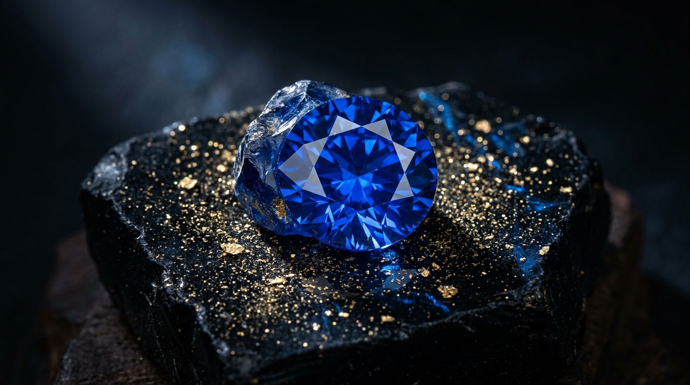

# 💎 Blue Meridian — Rare Ceylon Gemstones & High Fine Jewelry

[](https://chamodimandira.github.io/blue-meridian/)
[](https://developer.mozilla.org/en-US/docs/Web/HTML)
[](https://developer.mozilla.org/en-US/docs/Web/CSS)
[](https://developer.mozilla.org/en-US/docs/Web/JavaScript)
[](LICENSE)

> **Live Preview:** 🌐 [https://chamodimandira.github.io/blue-meridian/](https://chamodimandira.github.io/blue-meridian/)

> An authentic Haute Joaillerie digital maison showcasing unheated Ceylon royal blue sapphires, natural padparadscha, fine rubies, and bespoke jewelry commissions. Built entirely with pure vanilla technologies for ultra-fast, zero-dependency luxury performance.



---

## 🌟 Key Features

- **Cinematic Brand Logo Intro**: Full-screen luxury introductory experience featuring animated vector gemstone assembly, dynamic prismatic lens flares, floating celestial stardust particles (HTML5 Canvas), and a smooth velvet dissolve transition.
- **The Gem Vault & Real-Time Filter Engine**: Curated archive of unheated Ceylon gemstones with dynamic category filtering, cut sorting, carat range slider, and instant keyword search.
- **Multi-Currency Converter**: Real-time currency switching across **USD ($)**, **LKR (Rs)**, **EUR (€)**, and **GBP (£)** across all catalog valuations and checkout flows.
- **Bespoke High Jewelry Atelier**: Interactive custom ring builder allowing connoisseurs to pair rare sapphires with noble metals (Platinum 950, 18k Gold) and custom setting architectures (Micro-Pavé Halo, Three-Stone Trilogy, Cathedral).
- **Independent Lab Certificate Verification**: Interactive dossier verification tool for reports from the Gemological Institute of America (**GIA**) and Sri Lanka’s National Gem & Jewellery Authority (**NGJA**).
- **Collector's Bag & Concierge Checkout**: Slide-over acquisition drawer, real-time valuation updates, and private white-glove appointment scheduling.
- **Ceylon Heritage & Ethical Mining**: Editorial storytelling highlighting Ratnapura and Elahera eco-restorative pit mining, fair-share miner royalties, and master Sri Lankan lapidary arts.

---

## 🛠️ Technology Stack

- **Semantic HTML5**: Clean, accessible, SEO-optimized markup.
- **Vanilla CSS3**: Bespoke Dark Obsidian (`#0a0b0e`) and Champagne Gold (`#e2c98d`, `#d4af37`) design system, fluid CSS Grid/Flexbox layouts, glassmorphism, and hardware-accelerated keyframe animations.
- **Vanilla JavaScript (ES6+)**: Lightweight, zero-dependency reactive state management for currency conversion, live filtering, bag storage, interactive modals, and canvas particle simulations.
- **Typography**: Google Fonts (*Cinzel*, *Cormorant Garamond*, *Outfit*).
- **Icons**: Font Awesome 6.5.

---

## 🚀 Getting Started

### Local Preview
Simply open `index.html` in any modern web browser:
```bash
# Double click index.html or open via browser:
start index.html
```
No build tools, compilation, or package manager required!

---

## 📜 License

&copy; 2026 Blue Meridian Fine Gems Ltd. All Rights Reserved.  
Ratnapura • Colombo • London • Geneva.
